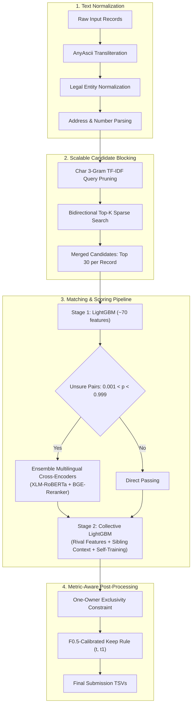

# 🏆 Amazon ML Challenge 2026: Business Entity Resolution

<div align="center">


### **Ranked < 500 out of ~10,000 participating teams (Top 5%)**
**Holdout Macro $F_{0.5}$: `0.9874`** | **Public Leaderboard $F_{0.5}$: `0.983`**

</div>

---

## 📌 Overview

This repository contains our end-to-end solution for the **Amazon ML Challenge 2026: Business Entity Resolution**. 

The task requires identifying and matching noisy, multilingual business entity records across disjoint datasets: mapping canonical records in **Source 1** (2.2M train / 1.73M test) to matching representations in **Source 2** (5.0M train / 4.9M test) and **Source 3** (5.3M train / 5.1M test).

Our solution operates **strictly on competition data**—no external databases, geocoding APIs, or proprietary pre-training sources were used. Built to be CPU-efficient and massively scalable, the pipeline easily processes over **10 million records** within resource-constrained environments (Kaggle 4-core CPU / 30 GB RAM).

---

## 🚀 Key Highlights & Results

- **Global Standing:** **Ranked under 500** among nearly **10,000 teams** across the nation.
- **Holdout Evaluation ($F_{0.5}$ Macro):** **`0.9874`** (Precision: `0.9982`, Recall: `0.9663`).
- **Public Leaderboard ($F_{0.5}$ Macro):** **`0.983`**.
- **Candidate Blocking Efficiency:** **`0.982` pair recall** on 10M+ records with a reduction ratio of **99.9994%** (pruned from trillions of combinations down to 30 candidates per Source 1 entity).
- **Zero-Shot Country Generalization:** Robust performance on unobserved test countries (e.g., France) without country-specific feature leaks or overfitting.

---

## 🏗️ System Architecture



---

## 🔬 Methodology & Core Innovations

### 1. High-Recall Bidirectional Blocking
- Built with character 3-gram TF-IDF (sublinear term frequency) over concatenated `name + address`.
- **Bidirectional sparse search:** Forward search (top 15 from Source 2, top 15 from Source 3) combined with reverse search (Source 2/3 ranking Source 1 in their top 3) captured **312,000+ true pairs** missed by standard unidirectional search.
- Scaled multi-threaded with `sparse_dot_topn` using query pruning (30 rarest 3-grams).

### 2. Deep Feature Engineering (~70 Pairwise Signals)
- **String & Token Similarities:** Jaro-Winkler, Levenshtein, Token Sort / Token Set ratios via `rapidfuzz`, IDF-weighted word Jaccard, and learned corporate keyword weights.
- **Structural Address & Digit Logic:** House number exact/fuzzy checks, PIN/ZIP code extraction, postal pattern matching across US, India, and European styles.
- **Legal Form Disambiguation:** Extraction and alignment of corporate suffixes (`Pvt Ltd`, `LLC`, `SARL`, `Inc`, etc.).

### 3. Collective Stage 2 & Rival Modeling
- **Rival Features:** Compares ambiguous candidate pairs against *all* competing Source 1 records that share the same address tokens or name keys.
- **Sibling Aggregation:** Leverages candidate support clusters across co-occurring entity representations.

### 4. Multilingual Transformer Cross-Encoder Ensemble
- Deployed fine-tuned **XLM-RoBERTa (Base & Large)** and **BAAI/bge-reranker-v2-m3** (568M params).
- Out-of-fold cross-encoder logits feed into Stage 2 for high-ambiguity pairs, providing cross-lingual semantic understanding across Latin, Devanagari, Bengali, and Dravidian scripts.

### 5. Metric-Aware Constrained Decoding
- **One-Owner Exclusivity:** Enforces the domain invariant that every Source 2/3 record belongs to at most one canonical Source 1 business.
- **Honest 2-Fold Threshold Optimization:** Calibrated decision thresholds $(t, t_1)$ maximizing Macro $F_{0.5}$ with strict split validation.

---

## 📈 Ablation & Leaderboard Progression

| Stage | Version / Experiment | Holdout $F_{0.5}$ | Public LB | Key Improvement |
|:---:|:---|:---:|:---:|:---|
| 1 | Baseline LightGBM (15 candidates) | 0.9570 | 0.9480 | Initial prototype |
| 2 | Full Data + Legal Form + Sparse Dot Blocking | 0.9803 | 0.9680 | Normalized legal noise & expanded blocking |
| 3 | + XLM-RoBERTa Cross-Encoder | 0.9825 | 0.9750 | Semantic embedding matching for hard pairs |
| 4 | Scale to 300k Cross-Encoder Pairs | 0.9836 | 0.9780 | Better generalization across multilingual noisy text |
| 5 | Cross-Encoder Ensemble (3 Models) | 0.9839 | 0.9790 | Ensemble stability |
| 6 | Top-1 Guarded Keep Rule | 0.9842 | 0.9800 | Precision retention on 1-match records |
| 7 | Candidate Expansion (30 Candidates) | 0.9849 | 0.9805 | Blocking recall improvement |
| 8 | + Rival Re-Scoring | 0.9861 | 0.9820 | Resolves multi-branch same-name collisions |
| 🏁 | **Final Submission (Stage 2 + Rival + 5-6 CEs + Self-Training)** | **`0.9874`** | **`0.9830`** | **Ranked < 500 / ~10,000 Teams** |

---

## 📂 Repository Structure

```plaintext
Amazon-ML-Challenge-2026/
├── Documentation_template.md        # Official challenge documentation & breakdown
├── build_submission.py              # Automated build & verification packager
├── output/                          # Generated predictions (gitignored)
│   ├── matching_results.tsv         # Final resolved matches
│   └── candidate_pairs.tsv          # Generated candidate pairs
└── code/
    └── business_entity_resolution/
        ├── requirements.txt         # Pinned production dependencies
        ├── README.md                # Sub-package technical notes
        ├── src/
        │   ├── run_pipeline.py      # Main CLI orchestration pipeline
        │   ├── config.py            # Global hyperparameter & path configurations
        │   ├── io_utils.py          # Fast TSV I/O & hash partitioning
        │   ├── normalize.py         # Text cleaning & transliteration pipeline
        │   ├── text_rules.py        # Legal form dictionaries & address regex rules
        │   ├── indic.py             # Script handling & Indic transliteration
        │   ├── blocking.py          # Sparse 3-gram TF-IDF candidate generation
        │   ├── run_blocking.py      # Blocking CLI driver
        │   ├── features.py          # Pairwise feature extraction engine
        │   ├── train.py             # Stage 1 LightGBM trainer & cross-fitting
        │   ├── cross_encoder.py     # Transformer inference & cross-encoder layer
        │   ├── stage2.py            # Collective feature builder & Stage 2 model
        │   ├── rival.py             # Disambiguation against rival branch entities
        │   ├── assign.py            # Constrained exclusivity assignment & thresholding
        │   └── evaluate.py          # Official Macro F0.5 scoring implementation
        ├── kaggle/                  # Kaggle execution runbooks & production kernels
        │   ├── RUNBOOK.md           # Step-by-step reproduction runbook
        │   ├── kernel_run.py        # Cloud runtime entry point
        │   ├── kernels/             # Executable kernel scripts (ens3, llm2-llm7, wide30)
        │   └── ctx/                 # Decision rules & 2-fold honest validation
        └── tests/                   # Test suite
            ├── test_normalize.py    # Unit tests for text normalization
            ├── test_enhancements.py # Tests for rival logic and feature rescues
            └── make_synthetic.py    # Synthetic end-to-end smoke test data generator
```

---

## ⚙️ Setup & Installation

### Requirements
- **Python 3.11+**
- Minimum **16 GB RAM** (30 GB recommended for full candidate generation)
- GPU optional (only needed if fine-tuning Transformer cross-encoders)

```bash
# Clone the repository
git clone https://github.com/DSingh256/Amazon-ML-Challenge-2026.git
cd Amazon-ML-Challenge-2026

# Install dependencies
pip install -r code/business_entity_resolution/requirements.txt
```

---

## 🏃 Reproducing the Pipeline

### Option 1: End-to-End Execution (Single Command)

```bash
python code/business_entity_resolution/src/run_pipeline.py all \
    --data-dir /path/to/dataset \
    --work-dir work \
    --n-jobs 4
```

This generates:
- `work/output/matching_results.tsv`
- `work/output/candidate_pairs.tsv`

### Option 2: Step-by-Step Execution

```bash
cd code/business_entity_resolution

# Step 1: Normalization, Blocking, Features & Model Training
python src/run_pipeline.py train --data-dir <DATA_DIR> --work-dir work

# Step 2: Prepare test features & candidate blocking
python src/run_pipeline.py test-prep --data-dir <DATA_DIR> --work-dir work

# Step 3: Score candidate pairs & assign matches
python src/run_pipeline.py assign --data-dir <DATA_DIR> --work-dir work
```

### Option 3: Fast Synthetic Smoke Test (No Dataset Required)

```bash
cd code/business_entity_resolution

# Generate synthetic dataset and verify pipeline end-to-end
python tests/make_synthetic.py --out-dir work/smoke_data
python src/run_pipeline.py all --data-dir work/smoke_data --work-dir work/smoke_run
```

---

## 🧪 Submission Packaging & Validation

To package the solution into the official competition submission zip:

```bash
python build_submission.py --team "404 Not found"
```

This runs syntax compilation, unit tests, stages the outputs, and produces the verified zip archive.

---

## 👥 Team: 404 Not Found (Team PI)

- **Abhishek Kumar Gupta**
- **Niraj Visave**
- **Dhairya Singh** ([@DSingh256](https://github.com/DSingh256))

---

## 📜 License

This project is licensed under the [MIT License](LICENSE).
